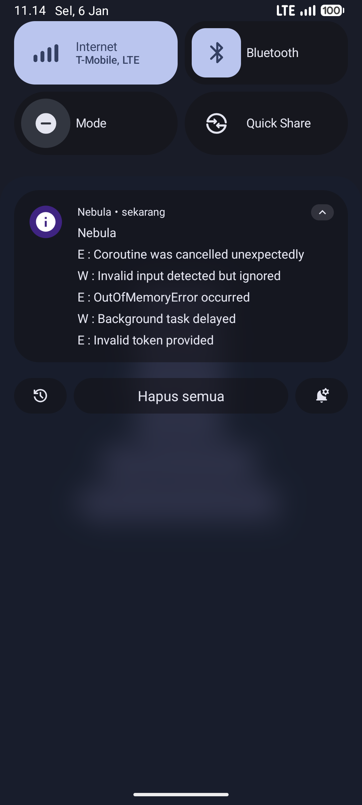
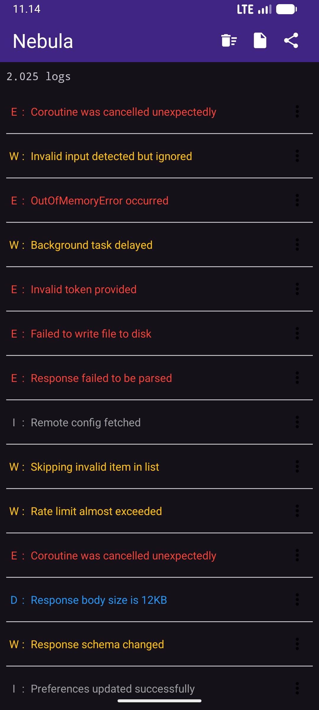

# Nebula

Nebula is an Android logging library that displays **real-time application logs directly in the notification bar**, enabling developers, QA, and support teams to inspect logs **without Logcat or Android Studio**.

This approach is especially useful when debugging on physical devices, staging builds, or environments where connecting a PC is inconvenient or impossible.

**Real-time logs displayed directly in the notification bar**

<div style="display: flex; justify-content: space-around;">
    
    
</div>

---

## Why Nebula?

Traditional Android logging relies heavily on Logcat, which requires a connected development environment. Nebula removes this dependency by exposing logs directly on the device UI.

Nebula is ideal when:

* QA or non-developers need access to logs
* Debugging issues on physical devices without a PC
* Inspecting logs in staging or internal builds
* Quickly understanding app behavior during manual testing

## When *Not* to Use Nebula

* Production releases distributed via Play Store
* Performance-critical or high-frequency logging scenarios

---

## Installation

Add the following dependencies to your **app-level** `build.gradle`:

```gradle
debugImplementation "io.github.zihadrizkyef:nebula:1.0.3"
releaseImplementation "io.github.zihadrizkyef:nebula-no-op:1.0.3"
```

> The `nebula-no-op` artifact ensures that all Nebula calls are stripped out in release builds with zero runtime overhead.

---

## Quick Start (2-Minute Setup)

### 1. Initialize Nebula

Initialize Nebula once in your `Application` class:

```kotlin
class MyApp : Application() {
    override fun onCreate() {
        super.onCreate()
        Nebula.init(this)
    }
}
```

### 2. Write Logs

Log messages will immediately appear in the notification bar:

```kotlin
Nebula.d("Checkout screen opened")
Nebula.i("User logged in")
Nebula.e("Payment failed")
```

Pull down the notification panel to view, expand, or dismiss logs in real time.

---

## Typical Use Cases

* Debugging bugs reported by QA on real devices
* Monitoring app flow during manual testing
* Inspecting logs on tablets, kiosks, or embedded devices
* Reducing dependency on Logcat for day-to-day debugging

---

## Sample App

A minimal sample application is available in the `/sample` directory to help you get started quickly.

The sample demonstrates:

* Nebula initialization
* Logging different log levels
* Real-time log updates in the notification bar

---

## Contributions

Contributions are welcome and appreciated.

To contribute:

1. Fork this repository
2. Create a new branch for your feature or fix
3. Submit a Pull Request with a clear description and rationale

Please ensure all changes are well-tested and documented.

---

## License

Nebula is released under the [MIT License](LICENSE).

---

## Contact

For questions, feedback, or bug reports:

* **Email**: [zihadrizkyef@gmail.com](mailto:zihadrizkyef@gmail.com)
* **GitHub Issues**: [Open an issue](https://github.com/zihadrizkyef/Nebula/issues)
