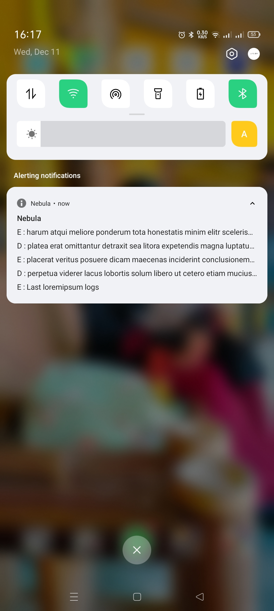
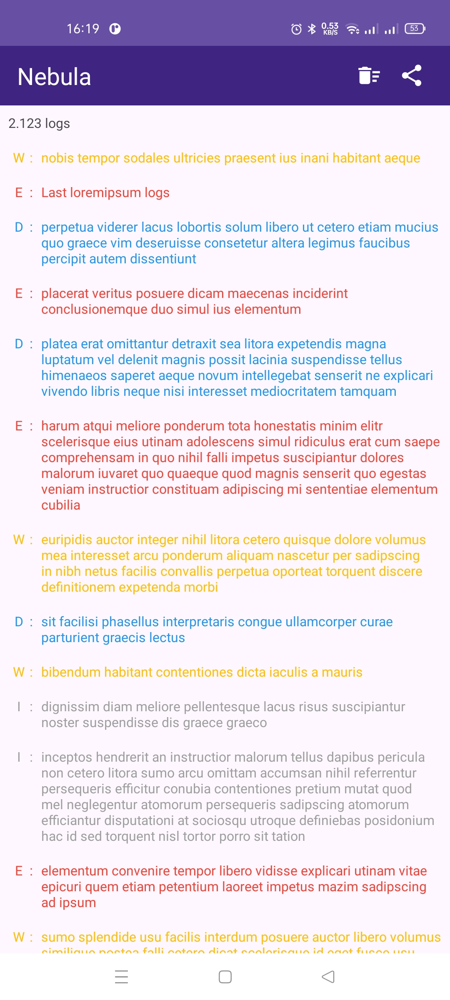

# Nebula

Nebula is an Android library that simplifies application logging by providing a real-time logging interface directly accessible through the notification bar. This unique approach ensures that important logs are always visible and easy to monitor during development and debugging.

<div style="display: flex; justify-content: space-around;">
    
    
</div>

## Installation

1. **Add Modules**

   Ensure the following modules are added to your project:

   - `nebula`
   - `nebula-no-op`

2. **Add Dependencies**

   Include the dependencies in your app `build.gradle` file:

   ```gradle
   implementation project(":nebula")
   debugImplementation project(":nebula-no-op")
   ```

## Usage

1. **Initialize Nebula**

   Initialize Nebula in your `Application` class:

   ```kotlin
   class MyApp : Application() {
       override fun onCreate() {
           super.onCreate()
           Nebula.init(this)
       }
   }
   ```

2. **Log Messages**

   Use Nebula to log messages, which will appear in the notification bar:

   ```kotlin
   Nebula.d("Debug log message")
   Nebula.e("Error log message")
   Nebula.i("Info log message")
   ```

   Logs can be expanded or dismissed directly from the notification bar for convenience.

## Contributions

We welcome contributions from the community! To contribute:

1. Fork this repository.
2. Create a new branch for your feature or fix.
3. Submit a Pull Request with a clear description of your changes.

## License

Nebula is released under the [MIT License](LICENSE).

## Contact

For further inquiries, feel free to reach out:

- **Email**: zihadrizkyef@gmail.com
- **GitHub Issues**: [Open an issue](https://github.com/zihadrizkyef/Nebula/issues)

---

We hope Nebula enhances your Android development experience by making logs more accessible! 🚀
